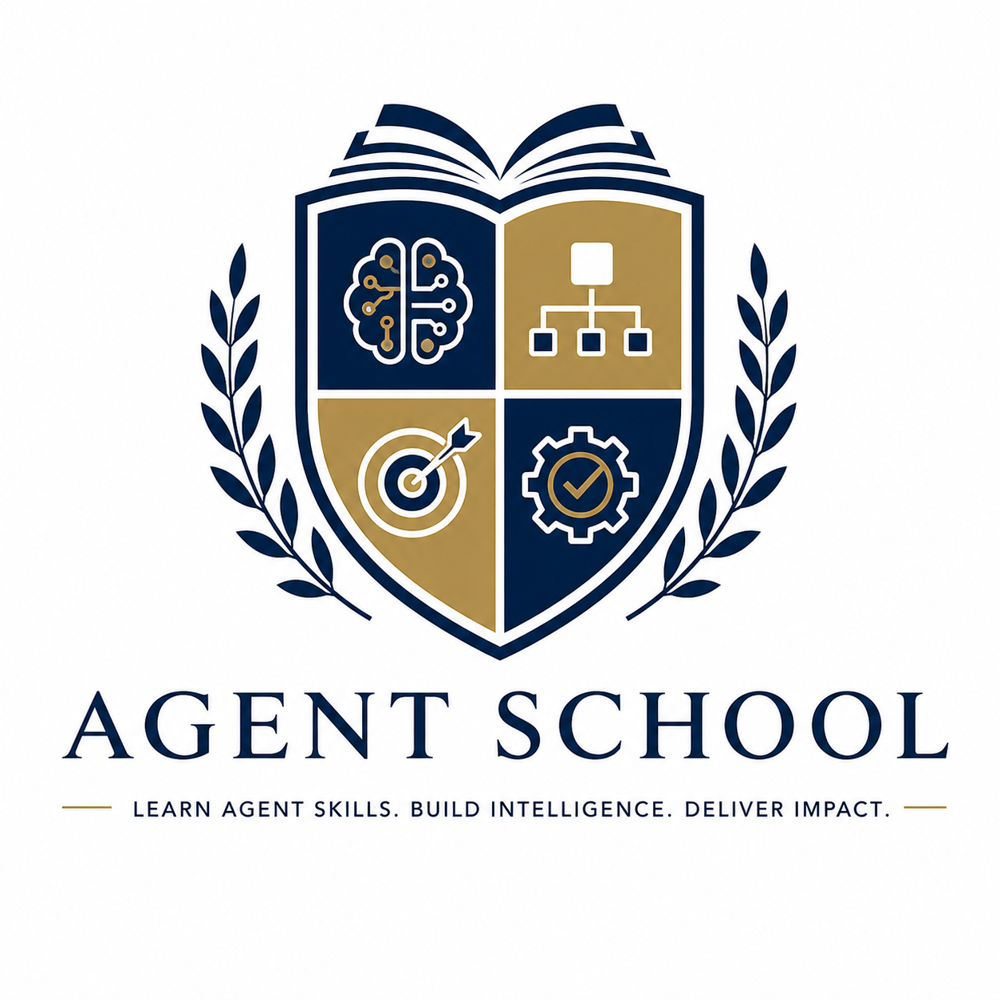

<p align="center">
  
</p>

# AgentSchool

*An open-source academy of excellence where artificial agents matriculate to learn, research, and distill reusable skills.*

AgentSchool is a Python runtime for local coding work, reproducible tool use, and fully agentic skill distillation.
It is based on OpenHarness and then streamlined into an AgentSchool-first runtime and learning workflow.

The institution comprises four primary facilities:

- **The Front Gates** (CLI entrypoint: `agentschool`).
- **The Core Syllabus** (A runtime assembling prompts, providers, tools, permissions, skills, plugins, and memory).
- **The Scholarship Programme** (The `agentschool learn` workflow, turning raw research and experiments into refined, reusable skill bundles).

## Our Educational Ethos

The central philosophy of AgentSchool is clear and uncompromising:

- **A working laboratory, not a parlour:** We treat the harness as a rigorous facility for real agents, not a mere chat interface.
- **Independent scholarship:** Learning must be *fully agentic*. An agent is expected to research, inspect, experiment, and iterate on its own initiative.
- **Lasting contributions:** We require each successful learning run to graduate into a reusable `SKILL.md`. We do not stop at a single solved task; we demand transferable knowledge.
- **Examinations in perspective:** We treat benchmarks and exams as mere checks for understanding, not as the Head Master that dictates the entire curriculum.

In short, AgentSchool is an institution of research, experimentation, and reusable skill distillation.

## The School Grounds

### The Runtime Classroom
AgentSchool is built around a rigorous query loop that:
1. Receives the assignment (user input).
2. Assembles the academic context.
3. Streams the scholar's (model's) output.
4. Executes approved tool calls.
5. Feeds the results back into the next turn for continuous improvement.

The institution supports headless runs and agentic learning workflows.

### The Tool Laboratory
The built-in tool registry equips our students with the core instruments required for their coding workflows:
- File reading, writing, and editing apparatus.
- Shell execution capabilities.
- `glob` and `grep` search instruments.
- Web fetching and searching tools.
- Notebook editing and LSP-assisted navigation.
- MCP-backed tools and resources.
- Background tasks, teams, and agent delegation (Prefects).
- Plan mode, worktree helpers, todos, cron jobs, and brief/config aides.

All laboratory instruments operate under strict schemas and must pass through the disciplinary permission layer.

### Memory and Discipline
A proper agent runtime requires both a library and a code of conduct. AgentSchool provides:
- Skill loading from Markdown texts.
- Plugin discovery for Claude-style workflows.
- Project memory and session resumption.
- Strict permission modes for interactive, plan-first, and full-auto operations.
- Hook execution around tool usage.
- Runtime dry-run previews to inspect a scholar's intentions before live execution.

### The Scholarship Programme
The learning workflow is the signature programme of this repository.

Each learning session is expected to:
- Research a given topic.
- Conduct local experiments when useful.
- Author a reusable, peer-reviewable `SKILL.md`.
- Maintain concise research notes.
- Emit a machine-readable learning report upon graduation.

We also maintain a dedicated SkillsBench integration. This exposes only the `instruction.md` to the learning run, ensuring the distilled skill is never contaminated by hidden solutions or test answers. 

That rule reflects the absolute philosophy of AgentSchool: **the goal is to learn a transferable skill from the visible assignment, not to overfit to hidden tests or benchmark-specific delivery details.**

## Admissions & Matriculation (Quick Start)

### Prerequisites
- Python 3.10+

The headless `-p/--print` mode is suitable for scripts and CI.

### Enrollment (Installation)

**Linux / macOS / WSL:**
```bash
curl -fsSL https://raw.githubusercontent.com/HKUDS/AgentSchool/main/scripts/install.sh | bash
```

**Windows PowerShell:**
```powershell
iex (Invoke-WebRequest -Uri "https://raw.githubusercontent.com/HKUDS/AgentSchool/main/scripts/install.ps1")
```

**Via PyPI:**
```bash
pip install agentschool-ai
```

### Induction (Configuration)

```bash
agentschool setup
```

### Sitting an Exam (Headless Run)
```bash
agentschool -p "Explain this repository"
agentschool -p "List the files that define the permission system" --output-format json
agentschool -p "Review the CLI flow" --output-format stream-json
```

### Reviewing the Syllabus (Dry Run)
Preview a session's intentions without executing it:
```bash
agentschool --dry-run
agentschool --dry-run -p "Review this repository and list likely skills"
agentschool --dry-run -p "/plugin list" --output-format json
```
`--dry-run` resolves settings, auth status, prompt assembly, tools, commands, skills, and MCP configuration, but strictly forbids calling the model or executing tools.

## The Houses (Provider Workflows)

AgentSchool treats providers as distinguished, named workflows rather than a single, monolithic API configuration.

**Common administrative commands:**
```bash
agentschool provider list
agentschool provider use <profile>
agentschool auth status
```

The built-in Houses include workflows for:
- Anthropic-compatible APIs
- Claude subscription bridging
- OpenAI-compatible APIs
- Codex subscription bridging
- GitHub Copilot
- Additional named Houses such as OpenRouter, Gemini, Moonshot, MiniMax, and Qwen-compatible setups.

You may also establish your own custom House (endpoint):
```bash
agentschool provider add my-endpoint \
  --label "My Endpoint" \
  --provider openai \
  --api-format openai \
  --auth-source openai_api_key \
  --model my-model \
  --base-url https://example.com/v1
```

## Modes of Study

AgentSchool supports explicit headless commands:
- **Print mode** via `agentschool -p ...`, which submits a prompt once and exits.
- **Learn mode** via `agentschool learn ...`, which runs the agentic skill-distillation workflow.

Useful print-mode applications:
```bash
agentschool -p "Summarize this codebase"
agentschool -p "Find all CLI subcommands" --output-format json
agentschool -p "Trace tool execution" --output-format stream-json
```
The print mode serves as the preferred entrypoint for scripting, CI automation, and subprocess-driven experiments.

## Rules & Discipline (Permission Modes)

The runtime enforces three strict disciplinary modes:
- `default`: The Master must be asked before any writes or command executions.
- `plan`: Write actions are entirely blocked while the agent inspects and drafts a plan.
- `full_auto`: Tool execution is permitted without interactive approval (for trusted scholars only).

Typical enforcement:
```bash
agentschool --permission-mode default -p "Summarize this repository"
agentschool --permission-mode plan -p "Inspect this module"
agentschool -p "Refactor this module" --permission-mode full_auto
```

## The Scholarship Programme (Workflows)

### Distilling a General Skill
To initiate a fully agentic learning session on a specific topic:
```bash
agentschool learn "debug Playwright flaky tests" --root .agentschool/learn
```
Upon successful completion, the scholar will produce:
```text
.agentschool/learn/
  topics/<topic-slug>/
    experiments/
    research/notes.md
    skill/
      SKILL.md
      refs/
      scripts/
```
Artifacts are preserved in the archives for future runs under the same goal slug.

### Learning From a SkillsBench Task
To conduct a learning session from a SkillsBench task directory:
```bash
agentschool learn \
  --task /path/to/task \
  --root .agentschool/learn
```
This command intentionally reads only `instruction.md` from the task. It constructs an isolated, instruction-only workspace before launching the run, ensuring hidden tests, solutions, and bundled skills do not leak into the scholar's work.

To optionally export the learned skill into a SkillsBench-compatible directory:
```bash
agentschool learn \
  --task /path/to/task \
  --root .agentschool/learn \
  --export-skills-dir /path/to/generated-skills
```
A dedicated script is also provided in the repository grounds:
```bash
scripts/run_task_skill.sh <task-name-or-path>
```
*(This script expects `OPENROUTER_API_KEY` and forwards to `agentschool learn --task ...`.)*

## Extracurricular Activities (Extensibility)

AgentSchool encourages expansion beyond the standard curriculum:
- Draft Markdown skills under `~/.agentschool/skills/`.
- Enroll plugins via `agentschool plugin install <path-or-url>`.
- Register plugin tools from a plugin's `tools/` directory.
- Invite MCP servers and surface their tools in the runtime.
- Establish new provider workflows and custom compatible endpoints.

Useful administrative commands:
```bash
agentschool plugin list
agentschool plugin install <source>
agentschool mcp list
```

## The Campus Map (Repository Layout)

```text
src/agentschool/
  api/           provider clients and registry
  auth/          credential flows and storage
  commands/      slash-command registry
  config/        settings, paths, and schema
  engine/        query loop, events, and usage tracking
  hooks/         pre/post tool hook execution
  mcp/           MCP config and client integration
  memory/        project memory scanning and retrieval
  permissions/   permission modes and checks
  plugins/       plugin loading and installation
  prompts/       runtime system-prompt assembly
  skills/        skill loading and built-in skills
  swarm/         teams, subprocess agents, and delegation
  tasks/         background task management
  tools/         built-in tool implementations
  ui/            runtime assembly and terminal app entrypoints

scripts/             install helpers, smoke tests, and task scripts
tests/               unit, integration, and end-to-end coverage
```

## The Common Room (Faculty & Development)

To join the faculty and contribute to the institution's development:

```bash
git clone https://github.com/HKUDS/AgentSchool.git
cd AgentSchool
uv sync --extra dev
```

Run the standard academic checks:
```bash
uv run ruff check src tests scripts
uv run pytest -q
```

The GitHub Actions workflow enforces our standards by running:
- Python tests on Python 3.10 and 3.11
- Ruff for Python quality

## The School Charter (License)

MIT. See `LICENSE`.
